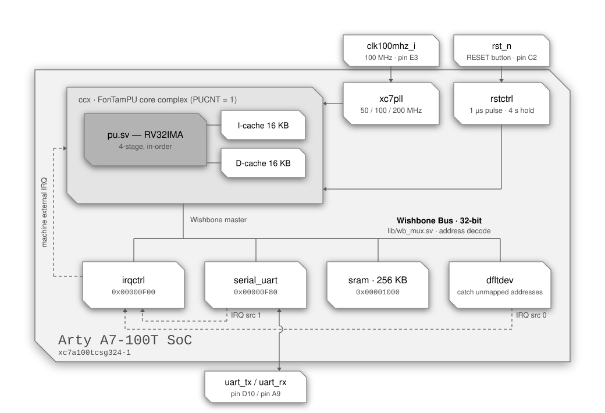

<div align="center">

# RV32 SoC — Arty A7-100T

**A single-core RISC-V system-on-chip built around the FonTamPU (`ftpu`) core complex,
targeting the Digilent Arty A7-100T.**


</div>

---

## Contents

- [Overview](#overview)
- [Block diagram](#block-diagram)
- [At a glance](#at-a-glance)
- [Memory map](#memory-map)
- [Device registers](#device-registers)
- [Interrupts](#interrupts)
- [CPU configuration](#cpu-configuration)
- [Clocking](#clocking)
- [Reset behaviour](#reset-behaviour)
- [Pin assignment](#pin-assignment)
- [Building the bitstream](#building-the-bitstream)
- [Loading a program](#loading-a-program)
- [Files](#files)
- [Notes and gotchas](#notes-and-gotchas)

---

## Overview

`artya7100.sv` is the top level of a compact RV32 SoC: one `ftpu` hart with private
instruction and data caches, a Wishbone peripheral interconnect, an interrupt
controller, a UART console, 256 KB of on-chip SRAM and a *default device* that
acknowledges and reports every access to an address no other device maps.

The program is baked into the SRAM at synthesis time via `$readmemh`, so the SoC
boots straight into application code at `0x1000` with no bootloader.

---

## Block diagram

<p align="center">
  
</p>

<div align="center">
<sub>Solid lines are Wishbone, clock/reset and I/O paths · dashed lines are interrupt paths</sub>
</div>


---

## At a glance

| | |
| :--- | :--- |
| **Board** | Digilent Arty A7-100T |
| **FPGA** | Xilinx Artix-7 `xc7a100tcsg324-1` |
| **Harts** | 1 (`CPU_COUNT = 1`) |
| **ISA** | RV32IMA + Zicsr, Machine and Supervisor privilege |
| **Pipeline** | 4-stage in-order, single issue, branch / JAL / RET prediction |
| **Core & bus clock** | 100 MHz |
| **Bus** | Wishbone, 32-bit data (`XWORDBITSZ = 32`), single master |
| **Caches** | 16 KB I-cache + 16 KB D-cache, direct-mapped |
| **RAM** | 256 KB on-chip BRAM (`SRAM_KBSIZE = 256`) |
| **Console** | UART, 115200 8N1 by default, 2 KB RX + 2 KB TX buffers |
| **Unmapped access** | Acknowledged by `dfltdev`: reads as `nop`, writes dropped, IRQ source 0 raised, address latched at `0xFFFFFFFC` |
| **Interrupt sources** | 2 — `dfltdev` (0), `serial_uart` (1) |
| **Reset vector** | `0x00001000` |
| **Initial `sp`** | `0x00041000` (end of RAM) |
| **Toolchain** | Vivado 2020.2 · `riscv32-unknown-elf` GCC |

---

## Memory map

All bases and sizes below are **byte** addresses. The interconnect table in
`artya7100.sv` (`WBPI_SDEVS`) stores them as byte values and `lib/wb_mux.sv`
converts them to word indices internally.

| # | Device | Module | Base | Last | Size | Cached |
| :-: | :--- | :--- | :--- | :--- | ---: | :-: |
| 0 | Interrupt controller | `dev/irqctrl.sv` | `0x00000F00` | `0x00000F03` | 4 B (1 word) | no |
| 1 | UART console | `dev/serial_uart.sv` | `0x00000F80` | `0x00000F87` | 8 B (2 words) | no |
| 2 | SRAM | `dev/sram.sv` | `0x00001000` | `0x00040FFF` | 256 KB | yes |
| 3 | Default device | `dev/dfltdev.sv` | *every other address* | — | — | no |
| ↳ | Fault address register | `dev/dfltdev.sv` | `0xFFFFFFFC` | `0xFFFFFFFF` | 4 B (1 word) | no |

```
 0x00000000        · · · unmapped → dfltdev · · ·    address 0 included
 0x00000EFF
 0x00000F00 ┌────────────────────────────────────┐
            │   irqctrl · 4 B                    │
 0x00000F03 └────────────────────────────────────┘
 0x00000F04        · · · unmapped → dfltdev · · ·
 0x00000F7F
 0x00000F80 ┌────────────────────────────────────┐
            │   serial_uart · 8 B                │   0xF80 data · 0xF84 command
 0x00000F87 └────────────────────────────────────┘
 0x00000F88        · · · unmapped → dfltdev · · ·
 0x00000FFF
 0x00001000 ┌────────────────────────────────────┐   reset vector = 0x00001000
            │                                    │
            │   SRAM · 256 KB · cacheable        │   .text .data .bss
            │                                    │
 0x00040FFF └────────────────────────────────────┘   sp starts at 0x00041000
 0x00041000        · · · unmapped → dfltdev · · ·
 0xFFFFFFFB
 0xFFFFFFFC ┌────────────────────────────────────┐
            │   dfltdev · fault address · 4 B    │   read OK · write faults
 0xFFFFFFFF └────────────────────────────────────┘
```

### How the decode works

`WBPI_ADDRLIMIT` is `0x1000 + 256 KB = 0x41000`, and the interconnect sizes its
address bus from that: only bits `[18:2]` of the byte address are carried, with
bits `[31:19]` OR-reduced into a single extra "out of range" bit so
**nothing aliases back into a real device** for any access at or above `0x80000`.

Slave 3 (`dev/dfltdev.sv`) is the catch-all for every address the table does not
claim. It never drives `bsy` and acknowledges every access on the following cycle,
so **an unmapped access always completes**. A read returns the instruction `nop`
(`0x00000013`) and a write is dropped. Both are faults: the address is latched in
the fault address register and interrupt source 0 is raised (see
[Device registers](#default-device--every-unmapped-address)). The only access
to unmapped space that is *not* a fault is a read of the fault address register
itself, at `0xFFFFFFFC`.

Decode is a sequential walk of `WBPI_SDEVS` (`lib/wb_mux.sv`): when an address
falls outside the currently selected device's range, the interconnect — once any
outstanding acknowledgements have drained — restarts at entry 0 and advances one
entry per cycle, holding the bus busy, until it finds the range containing the
address or exhausts the table (which selects the default device). Back-to-back
accesses within one device cost nothing extra; alternating between, say, the UART
and the SRAM re-walks the table at every switch. The default-device selection is
valid only for the address it was walked for: another address presented in that
cycle restarts the walk rather than being handed the default device.

> [!NOTE]
> The core marks everything outside `[0x1000, 0x41000)` as non-cacheable
> (`cpu_dcache_miss_w`), so device registers — the fault address register
> included — are always accessed straight through the bus and never sit stale in
> the D-cache.

> [!NOTE]
> The Verilator simulator (`rv32-sim/`) has no default device: its default slave
> never acknowledges, so the same access ends the simulation with a default-slave
> trap instead of raising an interrupt. Interrupt source 0 is reserved there so
> that source numbering matches the FPGA tops.

---

## Device registers

### Interrupt controller — `0x00000F00`

A single 32-bit register. A **write** submits a command, a subsequent **read**
retrieves its result; two memory operations are always needed.

| Word | Layout |
| :--- | :--- |
| write | `arg[31:2]` · `cmd[1:0]` |
| read | `resp[31:3]` · `rsvd[2]` · `cmd[1:0]` |

| `cmd` | Name | Purpose |
| :-: | :--- | :--- |
| `0b00` | `CMDDEVRDY` | Ready the controller for a new command; clears `resp` |
| `0b01` | `CMDACKIRQ` | Acknowledge an IRQ for destination `arg[31:3]`; `arg[2]` enables/disables further delivery. Returns the source index, `-2` if none pending, `-1` if raised by `CMDINTDST` |
| `0b10` | `CMDINTDST` | Raise an interrupt at destination `arg[31:3]` (used for IPIs); the destination `-1` (all ones) requests a system reset instead |
| `0b11` | `CMDENAIRQ` | Enable (`arg[2] = 1`) or disable a given interrupt source `arg[31:3]` |

The controller has accepted a command only when the `cmd` field read back is
`CMDDEVRDY`; otherwise resend `CMDDEVRDY`. Any non-`CMDDEVRDY` command written while
a transaction is in flight is silently dropped, so use an atomic read-modify-write
to stay thread-safe.

Every source and every destination is **disabled at reset**; nothing is delivered
until software enables the source with `CMDENAIRQ` and the destination with
`CMDACKIRQ` (`arg[2] = 1`).

A `CMDINTDST` targeting the destination `-1` (`arg[31:3]` all ones) is a **system
reset request**: the controller pulses its `rst_rqst_o` output to the reset
controller, which restarts its reset pulse, so every CPU, device and cache resets
and the SoC boots again from `0x1000` with its memory contents intact (see
[Reset behaviour](#reset-behaviour)). The command's result is `-1`, as for any
invalid destination; underLineOS exposes it as `_sysreset()`.

### UART console — `0x00000F80`

| Offset | Address | Register | Description |
| :-: | :--- | :--- | :--- |
| `+0x0` | `0x00000F80` | Data | Read receives one byte, write transmits one byte |
| `+0x4` | `0x00000F84` | Command | Write submits a command, read retrieves the result |

| `cmd` | Name | Purpose |
| :-: | :--- | :--- |
| `0b00` | `CMDDEVRDY` | Make the device accept a new command |
| `0b01` | `CMDGETBUFFERUSAGE` | `arg = 0` → RX bytes used, `arg = 1` → TX bytes used |
| `0b10` | `CMDSETINTERRUPT` | `arg = 0` disables; non-zero enables and sets the RX-usage threshold. Returns the buffer size |
| `0b11` | `CMDSETSPEED` | `arg = PHYCLKFREQ / bitrate`. Returns `PHYCLKFREQ` |

Reset defaults: **115200 baud**, 2048-byte RX and TX buffers (`BUFSZ = 2048`),
**interrupt disabled**. At 100 MHz, `CMDSETSPEED` for 115200 baud takes
`100000000 / 115200 = 868`.

> [!IMPORTANT]
> Reading the data register while the receive buffer is empty holds `wb_bsy_o` — the
> read **blocks** until a byte arrives. That is intentional (it makes `getchar()`
> work), but on a multi-hart build a blocked read holds the bus grant, which is why
> `lib/wb_arbiter.sv` bounds grant duration with `GRANTHELDLIMIT`.

### Default device — every unmapped address

`dev/dfltdev.sv` owns every address the table does not claim. It has one register,
the **fault address register**, read from the last word of the address space:

| Address | Access | Behaviour |
| :--- | :-: | :--- |
| `0xFFFFFFFC` | read | Returns the address of the **first** fault since the register was last read. Not a fault. |
| any other unmapped address | read | Returns `0x00000013` (`nop`); **fault** |
| any unmapped address, `0xFFFFFFFC` included | write | Dropped; **fault** |

A fault raises interrupt source 0 and, if no earlier fault is still waiting to be
read, latches its address. The request is held until it is acknowledged through
`irqctrl` (`CMDACKIRQ`); faults meanwhile keep it raised but are not reported
separately, save one landing in the very cycle of the acknowledgement, which raises
a fresh request. The register can also simply be polled — the address is latched
whether or not source 0 is enabled.

The value read is the address **as seen on the bus**, sign-extended: bits `[18:2]`
are exact, bit `19` is the OR of bits `[31:19]` of the faulting address and is
replicated into bits `[31:20]`, and bits `[1:0]` always read zero (the bus carries
word addresses, so the byte offset of the access is lost). Hence:

| Faulting address | Reads back as |
| :--- | :--- |
| below `0x00080000` (fits the address bus) | exactly |
| `0xFFF80000` – `0xFFFFFFFF` (a small negative pointer) | exactly |
| anything else | a negative value whose bits `[18:2]` are the faulting address's — the exact address is not recoverable |

Two details worth knowing:

- The register is **not cleared** by the read: it keeps the last latched address
  (`0` after reset) until the next fault overwrites it.
- Because only bits `[18:2]` and the OR bit travel on the bus, `0xFFFFFFFC` is the
  canonical address of the register but not the only one that reaches it: any
  address whose bits `[18:2]` are all ones and whose bits `[31:19]` are not all zero
  does. Use `(uintptr_t)-4`.

---

## Interrupts

The SoC instantiates `IRQSRCCOUNT = 2` sources and `IRQDSTCOUNT = CPU_COUNT = 1`
destination.

### Sources

| Index | Source | Constant | Raised when |
| :-: | :--- | :--- | :--- |
| 0 | `dfltdev` | `IRQ_DFLTDEV` | Any access to an unmapped address, other than a read of the fault address register |
| 1 | `serial_uart` | `IRQ_SERIAL` | RX buffer usage reaches the threshold set by `CMDSETINTERRUPT` |

Source 0 is reserved for the default device by convention on every top in the
repository, including `rv32-sim/` where it never fires.

### Destinations

| Index | Destination |
| :-: | :--- |
| 0 | hart 0 |

### Delivery

`irqctrl` dispatches to destinations round-robin, preferring any whose
`irq_dst_pri_i` is high (driven by each hart's `halted_o`, so halted harts are
favoured); the lowest index wins ties. At the core, a dispatched interrupt arrives
as a **machine external interrupt (MEI)**, or as **SEI** when the corresponding
`MIDELEG` bit is set.

| Mechanism | Where it lives |
| :--- | :--- |
| External interrupt (MEI / SEI) | `dev/irqctrl.sv`, memory-mapped at `0x00000F00` |
| Timer interrupt (MTI / STI) | CSRs `mtimecmp` `0x34D` and `mtimecmph` `0x35D` — **not** memory-mapped |
| Software interrupt (MSIP / SSIP) | **not implemented**; use `CMDINTDST` for IPIs |

> [!NOTE]
> There is no CLINT and no PLIC. The timer compare registers are ordinary CSRs, and
> `time`/`cycle` are read from the same counter. Vectored interrupts are not
> supported. Simultaneous interrupts are taken in the order MEI, SEI, MTI, STI.

Three behaviours worth coding around:

- **Acknowledge promptly.** `irqctrl` does not buffer requests; until the current
  one is acknowledged with `CMDACKIRQ` it cannot dispatch another.
- **The UART interrupt disarms itself.** It is disabled at reset (so no spurious
  interrupt can fire immediately after release) and disabled again each time a
  raised interrupt is acknowledged, so the handler must re-enable it.
- **The fault interrupt is imprecise.** It arrives as an ordinary external
  interrupt, several instructions after the access that caused it, and that access
  has already completed — a load has consumed the word `0x00000013`, a store has
  been dropped, a fetch has executed a `nop`. The core has no
  instruction-access-fault, so a *speculative* instruction fetch of an unmapped
  address — a wrong-path fetch launched before the redirect that cancels it — also
  reaches `dfltdev` and reports a fault that never happened architecturally. Read
  the fault address register in the handler to find out what was touched.

---

## CPU configuration

Selected in the header of `artya7100.sv`:

| Feature | Setting | Effect |
| :--- | :-: | :--- |
| `PURV32M` | on | `M` extension — `mul` / `div` / `rem` |
| `PUIMULDSP` | on | Multiplies in DSP48 slices instead of iterative radix-4 shift-add |
| `PUIDIVDSP` | off | Divide uses the default radix-4 digit-recurrence |
| `PUPREDICTJAL` | on | JAL prediction |
| `PUPREDICTBRANCH` | on | Branch prediction, BHT 4096 entries |
| `PUPREDICTRET` | on | Return prediction, RAS 8 entries |
| `PUEARLYREDIRECTFETCH` | off | Carried commented out — would fetch a mispredicted branch target one cycle earlier (one lost slot instead of two) |
| `PUICACHEFILLBYPASS` | off | Carried commented out — would hand the fetch stage the refilled word directly (an I-cache miss costs three slots instead of four) |
| `PUDCACHEREGRQST` | on | Registers the D-cache request path (+1 cycle, better timing) |
| `PUDCACHEREGRESP` | on | Registers the D-cache response path (+1 cycle, better timing) |
| `PUAMOREGWB` | off | AMO write-back computed from the live D-cache response |
| `PURV32ZBA/ZBB/ZBC/ZBS` | off | Bit-manipulation extensions disabled |
| `PURV32ZFINX` | off | No FPU — software floating point |
| `PUFDIVDSP2` / `PUFSQRTDSP2` | on | Pre-selects correctly-rounded DSP Newton-Raphson `fdiv` / `fsqrt` for a Zfinx build; inert while `PURV32ZFINX` is off |

Atomics (`lr` / `sc` / `amo*`) are always present, so the effective ISA string is
**RV32IMA**. Caches are `ICACHESZ = DCACHESZ = 16` KB with `ICACHEWAYCNT =
DCACHEWAYCNT = 1` (direct-mapped). `IMULCNT` is left at the `ccx` default of 1:
the pipelined multiplier accepts a new multiply while results queue for
write-back, so a second instance would buy no cycles.

The core is reset with `rstaddr_i = rstaddr2_i = 0x1000` and `spval_i = 0x41000`, so
execution starts at the bottom of RAM with the stack pointer at the top of it.

---

## Clocking

`lib/xc7pll_100_to_50_100_200.sv` turns the 100 MHz board oscillator into 50, 100 and
200 MHz. The whole SoC — CPU, interconnect, UART PHY — runs in the **100 MHz**
domain, so there is no clock-domain crossing (`USEMEMCLKDOM` evaluates to 0 for a
single hart with a D-cache).

> [!NOTE]
> The 50 MHz and 200 MHz outputs and the PLL `locked` signal are generated but not
> currently consumed. They are there for peripherals that need them.

---

## Reset behaviour

`lib/rstctrl.sv` is instantiated with `RSTDURATION = 100` cycles (1 µs) and
`RSTTHRESH = 400000000` cycles (**4 s**) off `rst_n` (the `RESET` button, pin `C2`).
Its behaviour is deliberate and surprising the first time:

| Event | Result |
| :--- | :--- |
| Power-on / after configuration | SoC is **held in reset** — it does not start on its own |
| First press of `RESET` | Releases reset after a 1 µs pulse; the SoC begins executing |
| Short press afterwards | **Ignored** |
| Press held ≥ 4 s | Asserts a fresh 1 µs reset pulse |
| Software request (`_sysreset()`, ie: `CMDINTDST` with the destination `-1`) | Asserts a fresh 1 µs reset pulse at once, no button hold needed |

> [!TIP]
> If the board appears dead after programming, press `RESET` once — that is the
> intended way to start it. To reset a running system, hold `RESET` for four seconds,
> or have the program request it with `_sysreset()`.

---

## Pin assignment

From `artya7100.xdc`:

| Signal | Pin | Standard | Board net |
| :--- | :-: | :--- | :--- |
| `clk100mhz_i` | `E3` | LVCMOS33 | `gclk[100]`, 100 MHz oscillator |
| `rst_n` | `C2` | LVCMOS33 | `ck_rst` (RESET button) |
| `uart_rx` | `A9` | LVCMOS33 | `uart_txd_in` (from the USB-UART bridge) |
| `uart_tx` | `D10` | LVCMOS33 | `uart_rxd_out` (to the USB-UART bridge) |

Bitstream settings: compression enabled, `CONFIGRATE 33`, `CONFIG_MODE SPIx4`,
`CFGBVS VCCO` at 3.3 V.

---

## Building the bitstream

Requires **Vivado 2020.2** (the project file declares that version; newer Vivado will
offer to upgrade it).

```sh
cd rv32-artya7100/vivado2020
vivado artya7100.xpr
```

Then run synthesis, implementation and *Generate Bitstream*, and program the board
from the Hardware Manager.

The project's top module is `artya7100`, sourced directly from `../artya7100.sv`,
with the Verilog include directories set to the repository root and `cpu/` — that
is how the `` `include "lib/..." `` and `` `include "cpu/..." `` directives in
`artya7100.sv` resolve. If you build outside this project, reproduce both include
paths.

Two things the project does beyond the defaults:

- **A latch fails the build.** A project message rule raises `Synth 8-327`
  (*inferring latch*) from warning to error, so a synthesis run that infers a latch
  stops at `synth_design` instead of quietly completing.
- **Twenty-one implementation runs.** `impl_1` builds on the default strategy;
  `impl_2` … `impl_21` each apply one of Vivado's *Performance_\** / *Congestion_\**
  strategies off the same `synth_1`. Launching them all is how timing closure at
  100 MHz is swept; for a routine build, `impl_1` is enough.

Open a console on the board's USB-UART bridge at **115200 8N1**:

```sh
picocom -q --imap lfcrlf -b 115200 /dev/ttyUSB1     # or screen, minicom, ...
```

---

## Loading a program

There is no bootloader. SRAM contents come from `$readmemh` at elaboration time, so on
this top as committed — one console, no gdb channel — **changing the program means
re-running synthesis and implementation.**

With a gdb channel (the `examples/*/serial_jtag` branches add serial_jtag channels the
OpenOCD bridge of `tools/serial_jtag/` exposes as a pty), a running underLineOS image
linked with `-lgdbstub` can be replaced from gdb without a new bitstream: `reload`
(from `tools/underLineOS.gdb`: it sets the stub's reload flag and resumes into
`_sysreset()`, the software reset request of [Reset behaviour](#reset-behaviour)),
`Ctrl-C` once the console shows the stub's loader awaiting gdb, then `file`, `load`,
`continue`; the loaded image starts by another soft reset. Holding `RESET` for four
seconds after setting the flag is the manual alternative, and it is the way back when
a reload flag was left set: the next boot then parks in the loader saying so on the
console, and `continue` reboots. The underLineOS documentation (GDB stub, *Loading a
new program*) has the details and the limitations.

The build knobs are `` `ifndef ``-guarded defaults at the top of `artya7100.sv`, so
they can be overridden from the Vivado *Verilog options* (`verilog_define`) without
editing the file:

```systemverilog
`ifndef CPU_COUNT
`define CPU_COUNT 1
`endif
`ifndef XWORDBITSZ
`define XWORDBITSZ 32
`endif
`ifndef SRAM_KBSIZE
`define SRAM_KBSIZE 256
`endif
`ifndef SRAM_INITFILE
`define SRAM_INITFILE "../../../../rv32-sim/apps/coremark/rv32/coremark.32.hex"
`endif
```

`SRAM_INITFILE` is resolved by `$readmemh` relative to the synthesis run directory
(`vivado2020/artya7100.runs/synth_1/`), which is why the default climbs four levels
to reach the repository root.

The default image is CoreMark. Any application under [`rv32-sim/apps/`](../rv32-sim/apps)
— `helloworld`, `donut`, `tinyraytracer`, `isatests`, … — can be dropped in by
pointing `SRAM_INITFILE` at its `*.32.hex`.

To build your own, link at `0x1000` and emit a whitespace-separated list of 32-bit
words:

```sh
riscv32-unknown-elf-gcc -O3 -Wl,-z,max-page-size=4 -o app.elf app.c
riscv32-unknown-elf-objcopy -O binary app.elf app.bin
truncate --size=%4 app.bin
hexdump -v -e '/4 "%08x "' app.bin > app.32.hex
```

The `.32.hex` suffix matters: the same makefiles also emit 64/128/256-bit variants
for wider `XWORDBITSZ` builds, and this target uses a 32-bit bus.

> [!NOTE]
> `SRAM_KBSIZE` must stay a power of two. Raising it moves the end of RAM, and with
> it `WBPI_ADDRLIMIT`, the initial stack pointer and the cacheable window — all of
> which are derived from it automatically. Widening `WBPI_ADDRLIMIT` also widens
> the address bus, and with it the window of addresses the fault address register
> reports exactly.

---

## Files

| Path | Description |
| :--- | :--- |
| `artya7100.sv` | SoC top level: build-time defaults, PLL, reset, core complex, interconnect, peripherals |
| `artya7100.xdc` | Pin, clock and bitstream constraints |
| `vivado2020/artya7100.xpr` | Vivado 2020.2 project: one synthesis run, 21 implementation runs, latch-is-an-error rule |
| `.README.md/block_diagram.svg` | The block diagram above |

Shared sources come from the repository root: [`cpu/`](../cpu) (core complex),
[`dev/`](../dev) (Wishbone peripherals, the default device included) and
[`lib/`](../lib) (PLL, reset, FIFOs, interconnect).

---

## Notes and gotchas

- **Press `RESET` once after programming** — the SoC is held in reset until you do.
- **Unmapped accesses are reported, not trapped.** `dfltdev` acknowledges them: a
  read returns `nop`, a write vanishes, interrupt source 0 is raised and the
  address is latched at `0xFFFFFFFC`. A program that never enables source 0
  therefore runs on past a wild pointer — poll the fault address register if in
  doubt. The lowest mapped device sits at `0xF00` precisely so that a
  null-pointer access is reported rather than decoded.
- **The fault interrupt is imprecise**, and a speculative instruction fetch can
  raise it without any instruction at that address ever executing (see
  [Interrupts](#delivery)).
- **Atomics bypass the D-cache** and do not participate in cache coherency. A
  variable manipulated atomically must be accessed *only* through atomic
  instructions, and must be initialised atomically if it lives in runtime-allocated
  memory. Statically allocated variables start zeroed and are safe.
- **Do not build the toolchain with `-msave-restore`.** The millicode it calls enters
  through a `JALR` writing `x5` and returns through a `JALR` reading `x5`; the return
  address stack only recognises `x1`, so neither is predicted.
- **Set `mtvec` before anything can trap.** It resets to `0`, and a trap taken
  while the trap vector is still null halts the hart indefinitely — the board
  simply looks dead. A halted hart wakes only on an enabled, pending interrupt.
- **A read of the UART data register blocks** until a byte is available.
- The Wishbone arbiter is not instantiated here — with a single master
  (`WBPI_MDEVCOUNT = 1`) it is optimised away. The bus downsizers named by
  `WBPI_DNSIZR` are likewise inactive, since `XWORDBITSZ == WORDBITSZ == 32`.
- For iterating on software, the Verilator model in [`rv32-sim/`](../rv32-sim) runs
  the same RTL far faster than the synthesis loop — but note it traps on an
  unmapped access where this SoC reports one.

---

<div align="center">
<sub>

SPDX-License-Identifier: **GPL-2.0-only** · © William Fonkou Tambe

</sub>
</div>
