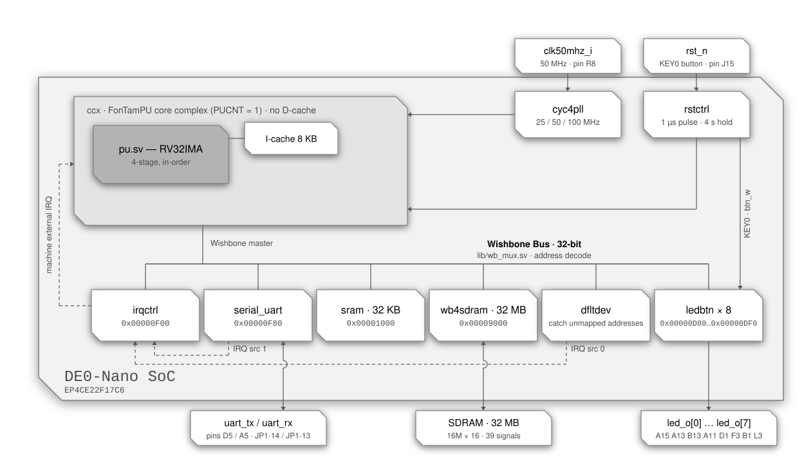

<div align="center">

# RV32 SoC — DE0-Nano

**A single-core RISC-V system-on-chip built around the FonTamPU (`ftpu`) core complex,
targeting the Terasic DE0-Nano.**


</div>

---

## Contents

- [Overview](#overview)
- [Block diagram](#block-diagram)
- [At a glance](#at-a-glance)
- [Memory map](#memory-map)
- [Device registers](#device-registers)
- [Interrupts](#interrupts)
- [CPU configuration](#cpu-configuration)
- [Clocking](#clocking)
- [Reset behaviour](#reset-behaviour)
- [Pin assignment](#pin-assignment)
- [Building the bitstream](#building-the-bitstream)
- [Loading a program](#loading-a-program)
- [The shipped program](#the-shipped-program)
- [Files](#files)
- [Notes and gotchas](#notes-and-gotchas)

---

## Overview

`de0nano.sv` is the top level of a compact RV32 SoC: one `ftpu` hart with a private
instruction cache and no data cache, a Wishbone peripheral interconnect, an interrupt
controller, a UART console, eight LED/button registers, 32 KB of on-chip RAM, the
board's 32 MB SDRAM and a *default device* that acknowledges and reports every access
to an address no other device maps.

The program is baked into the on-chip RAM at synthesis time via `$readmemh`, so the SoC
boots straight into application code at `0x1000` with no bootloader. The SDRAM is
mapped right above the on-chip RAM and holds the stack and the heap; nothing loads it,
so it is empty at power-up and the program itself has to fit in the 32 KB.

---

## Block diagram

<p align="center">
  
</p>

<div align="center">
<sub>Solid lines are Wishbone, clock/reset and I/O paths · dashed lines are interrupt paths</sub>
</div>


---

## At a glance

| | |
| :--- | :--- |
| **Board** | Terasic DE0-Nano |
| **FPGA** | Intel Cyclone IV E `EP4CE22F17C6` |
| **Harts** | 1 (`CPU_COUNT = 1`) |
| **ISA** | RV32IMA + Zicsr, Machine and Supervisor privilege |
| **Pipeline** | 4-stage in-order, single issue, branch / JAL / RET prediction |
| **Core & bus clock** | 50 MHz |
| **Bus** | Wishbone, 32-bit data (`XWORDBITSZ = 32`), single master |
| **Caches** | 8 KB I-cache, direct-mapped · no D-cache |
| **RAM** | 32 KB on-chip (`SRAM_KBSIZE = 32`) + 32 MB SDRAM (`SDRAM_MAPSZ`) |
| **Console** | UART, 115200 8N1 by default, 256 B RX + 256 B TX buffers, on an external 3.3 V USB-serial dongle |
| **LEDs** | 8, one 32-bit register each at `0xD80` … `0xDF0` |
| **Button** | `KEY0`, read back through the LED registers — it is also the reset button |
| **Unmapped access** | Acknowledged by `dfltdev`: reads as `nop`, writes dropped, IRQ source 0 raised, address latched at `0xFFFFFFFC` |
| **Interrupt sources** | 2 — `dfltdev` (0), `serial_uart` (1) |
| **Reset vector** | `0x00001000` |
| **Initial `sp`** | `0x02009000` (end of the SDRAM) |
| **Toolchain** | Quartus Prime 25.1 · `riscv32-unknown-elf` GCC |

---

## Memory map

All bases and sizes below are **byte** addresses. The interconnect table in
`de0nano.sv` (`WBPI_SDEVS`) stores them as byte values and `lib/wb_mux.sv`
converts them to word indices internally.

| # | Device | Module | Base | Last | Size |
| :-: | :--- | :--- | :--- | :--- | ---: |
| 0 | LED 0 / button | `dev/ledbtn.sv` | `0x00000D80` | `0x00000D83` | 4 B (1 word) |
| 1 | LED 1 / button | `dev/ledbtn.sv` | `0x00000D90` | `0x00000D93` | 4 B (1 word) |
| 2 | LED 2 / button | `dev/ledbtn.sv` | `0x00000DA0` | `0x00000DA3` | 4 B (1 word) |
| 3 | LED 3 / button | `dev/ledbtn.sv` | `0x00000DB0` | `0x00000DB3` | 4 B (1 word) |
| 4 | LED 4 / button | `dev/ledbtn.sv` | `0x00000DC0` | `0x00000DC3` | 4 B (1 word) |
| 5 | LED 5 / button | `dev/ledbtn.sv` | `0x00000DD0` | `0x00000DD3` | 4 B (1 word) |
| 6 | LED 6 / button | `dev/ledbtn.sv` | `0x00000DE0` | `0x00000DE3` | 4 B (1 word) |
| 7 | LED 7 / button | `dev/ledbtn.sv` | `0x00000DF0` | `0x00000DF3` | 4 B (1 word) |
| 8 | Interrupt controller | `dev/irqctrl.sv` | `0x00000F00` | `0x00000F03` | 4 B (1 word) |
| 9 | UART console | `dev/serial_uart.sv` | `0x00000F80` | `0x00000F87` | 8 B (2 words) |
| 10 | On-chip RAM | `dev/sram.sv` | `0x00001000` | `0x00008FFF` | 32 KB |
| 11 | SDRAM | `dev/wb4sdram.sv` | `0x00009000` | `0x02008FFF` | 32 MB |
| 12 | Default device | `dev/dfltdev.sv` | *every other address* | — | — |
| ↳ | Fault address register | `dev/dfltdev.sv` | `0xFFFFFFFC` | `0xFFFFFFFF` | 4 B (1 word) |

```
 0x00000000        · · · unmapped → dfltdev · · ·    address 0 included
 0x00000D7F
 0x00000D80 ┌────────────────────────────────────┐
            │   ledbtn 0 · 4 B                   │   LED 0 · button
 0x00000D83 └────────────────────────────────────┘
 0x00000D84        · · · unmapped → dfltdev · · ·    the 12 B after each
 0x00000D8F                                          LED register
 0x00000D90 ┌────────────────────────────────────┐
            │   ledbtn 1 … 7 · 4 B each          │   16 B apart, 12 B unmapped
 0x00000DF3 └────────────────────────────────────┘   after each · ledbtn 7 at 0xDF0
 0x00000DF4        · · · unmapped → dfltdev · · ·
 0x00000EFF
 0x00000F00 ┌────────────────────────────────────┐
            │   irqctrl · 4 B                    │
 0x00000F03 └────────────────────────────────────┘
 0x00000F04        · · · unmapped → dfltdev · · ·
 0x00000F7F
 0x00000F80 ┌────────────────────────────────────┐
            │   serial_uart · 8 B                │   0xF80 data · 0xF84 command
 0x00000F87 └────────────────────────────────────┘
 0x00000F88        · · · unmapped → dfltdev · · ·
 0x00000FFF
 0x00001000 ┌────────────────────────────────────┐   reset vector = 0x00001000
            │   sram · 32 KB · on-chip           │   .text .data .bss
 0x00008FFF └────────────────────────────────────┘
 0x00009000 ┌────────────────────────────────────┐
            │                                    │
            │   sdram · 32 MB · off-chip         │   heap, stack
            │                                    │
 0x02008FFF └────────────────────────────────────┘   sp starts at 0x02009000
 0x02009000        · · · unmapped → dfltdev · · ·
 0xFFFFFFFB
 0xFFFFFFFC ┌────────────────────────────────────┐
            │   dfltdev · fault address · 4 B    │   read OK · write faults
 0xFFFFFFFF └────────────────────────────────────┘
```

### How the decode works

`WBPI_ADDRLIMIT` is `0x1000 + 32 KB + 32 MB = 0x2009000`, and the interconnect sizes its
address bus from that: only bits `[25:2]` of the byte address are carried, with
bits `[31:26]` OR-reduced into a single extra "out of range" bit so
**nothing aliases back into a real device** for any access at or above `0x4000000`.

Slave 12 (`dev/dfltdev.sv`), the last of the thirteen, is the catch-all for every
address the table does not claim. It never drives `bsy` and acknowledges every access
on the following cycle, so **an unmapped access always completes**. A read returns
the instruction `nop` (`0x00000013`) and a write is dropped. Both are faults: the
address is latched in the fault address register and interrupt source 0 is raised (see
[Device registers](#default-device--every-unmapped-address)). The only access to
unmapped space that is *not* a fault is a read of the fault address register itself,
at `0xFFFFFFFC`.

Decode is a sequential walk of `WBPI_SDEVS` (`lib/wb_mux.sv`): when an address
falls outside the currently selected device's range, the interconnect — once any
outstanding acknowledgements have drained — restarts at entry 0 and advances one
entry per cycle, holding the bus busy, until it finds the range containing the
address or exhausts the table (which selects the default device). Reaching entry *j*
therefore costs at least *j* + 1 stalled cycles: 1 to 8 for the LED registers, 9 for
the interrupt controller, 10 for the UART, **11 for the on-chip RAM, 12 for the SDRAM**
and 13 for the default device. Back-to-back accesses within one device cost nothing
extra; alternating between two devices re-walks the table at every switch. The
default-device selection is valid only for the address it was walked for: another
address presented in that cycle restarts the walk, so two consecutive accesses to
unmapped addresses each pay the full walk — the one exception being the word at
address 0, which the default entry's own one-word range decodes without a walk.

> [!NOTE]
> This SoC has no D-cache, so every load and store is a bus transaction and pays
> that walk whenever it switches device: a stack access in the SDRAM alternating with
> a global in the on-chip RAM costs 11 + 12 stalled cycles per round trip, before the
> devices' own latency. The cacheable window `[0x1000, 0x2009000)` is still computed in
> `de0nano.sv` (`cpu_dcache_miss_w`) but has nothing left to steer. Instruction
> fetches, on the other hand, are cached from *any* address: the I-cache has no
> non-cacheable window, so a fetch from a device register, from the SDRAM or from
> unmapped space (which returns `nop`) is cached exactly like one from the on-chip RAM.

> [!NOTE]
> The Verilator simulator (`rv32-sim/`) has no default device, no LED registers and no
> SDRAM: its default slave never acknowledges, so an access to any of those addresses
> ends the simulation with a default-slave trap instead of raising an interrupt.
> Interrupt source 0 is reserved there so that source numbering matches the FPGA tops.

---

## Device registers

### LED and button registers — `0x00000D80` … `0x00000DF0`

Eight identical instances of `dev/ledbtn.sv`, one per green LED, each a single
32-bit word 16 bytes apart (`0xD80`, `0xD90`, … `0xDF0`); the 12 bytes after each one
are unmapped.

| Access | Behaviour |
| :--- | :--- |
| write | LED *n* lights when the written word is non-zero and goes dark when it is zero |
| read | `1` while `KEY0` is pressed, `0` otherwise, zero-extended to 32 bits |

The device ignores the address bits and the byte-enable lanes it is handed (the core
zero-fills the untouched lanes of a byte or half-word store, so a `sb` of 0 or 1 works
just as well). All eight instances read the same button — the board has only the one
wired up — so any of the eight registers can be polled. The registers never stall the
bus and raise no interrupt. The LED bit is **not reset**: a SoC reset leaves each LED
as the previous program set it, and after configuration it holds the tool's power-up
default until the program writes it.

### Interrupt controller — `0x00000F00`

A single 32-bit register. A **write** submits a command, a subsequent **read**
retrieves its result; two memory operations are always needed.

| Word | Layout |
| :--- | :--- |
| write | `arg[31:2]` · `cmd[1:0]` |
| read | `resp[31:3]` · `rsvd[2]` · `cmd[1:0]` |

| `cmd` | Name | Purpose |
| :-: | :--- | :--- |
| `0b00` | `CMDDEVRDY` | Ready the controller for a new command; clears `resp` |
| `0b01` | `CMDACKIRQ` | Acknowledge an IRQ for destination `arg[31:3]`; `arg[2]` enables/disables further delivery. Returns the source index, `-2` if none pending, `-1` if raised by `CMDINTDST` |
| `0b10` | `CMDINTDST` | Raise an interrupt at destination `arg[31:3]` (used for IPIs); the destination `-1` (all ones) requests a system reset instead |
| `0b11` | `CMDENAIRQ` | Enable (`arg[2] = 1`) or disable a given interrupt source `arg[31:3]` |

The controller has accepted a command only when the `cmd` field read back is
`CMDDEVRDY`; otherwise resend `CMDDEVRDY`. Any non-`CMDDEVRDY` command written while
a transaction is in flight is silently dropped, so use an atomic read-modify-write
to stay thread-safe.

Every source and every destination is **disabled at reset**; nothing is delivered
until software enables the source with `CMDENAIRQ` and the destination with
`CMDACKIRQ` (`arg[2] = 1`).

A `CMDINTDST` targeting the destination `-1` (`arg[31:3]` all ones) is a **system
reset request**: the controller pulses its `rst_rqst_o` output to the reset
controller, which restarts its reset pulse, so every CPU, device and cache resets
and the SoC boots again from `0x1000` with its memory contents intact (see
[Reset behaviour](#reset-behaviour)). The command's result is `-1`, as for any
invalid destination; underLineOS exposes it as `_sysreset()`.

### UART console — `0x00000F80`

| Offset | Address | Register | Description |
| :-: | :--- | :--- | :--- |
| `+0x0` | `0x00000F80` | Data | Read receives one byte, write transmits one byte |
| `+0x4` | `0x00000F84` | Command | Write submits a command, read retrieves the result |

| `cmd` | Name | Purpose |
| :-: | :--- | :--- |
| `0b00` | `CMDDEVRDY` | Make the device accept a new command |
| `0b01` | `CMDGETBUFFERUSAGE` | `arg = 0` → RX bytes used, `arg = 1` → TX bytes used |
| `0b10` | `CMDSETINTERRUPT` | `arg = 0` disables; non-zero enables and sets the RX-usage threshold. Returns the buffer size |
| `0b11` | `CMDSETSPEED` | `arg = PHYCLKFREQ / bitrate`. Returns `PHYCLKFREQ` |

Reset defaults: **115200 baud**, 256-byte RX and TX buffers (`BUFSZ = 256`),
**interrupt disabled**. At 50 MHz, `CMDSETSPEED` for 115200 baud takes
`50000000 / 115200 = 434`, and `CMDSETINTERRUPT` returns 256.

The data register is live only while the device reads back `CMDDEVRDY`: a data write
issued while a command result is still waiting to be read is dropped, and a data read
returns that result instead of a byte.

> [!IMPORTANT]
> Reading the data register while the receive buffer is empty holds `wb_bsy_o` — the
> read **blocks** until a byte arrives — and so does writing it while the transmit
> buffer is nearly full (255 of its 256 bytes queued), until a byte has gone out. That
> is intentional (it makes `getchar()` work and never loses output), but on a
> multi-hart build a blocked access holds the bus grant, which is why
> `lib/wb_arbiter.sv` bounds grant duration with `GRANTHELDLIMIT` — moot here, where
> the single master needs no arbiter.

### SDRAM — `0x00009000`

`dev/wb4sdram.sv` drives the board's 16M × 16 SDR SDRAM — 13 row, 9 column and 2 bank
address bits over a 16-bit data bus, 32 MB in all — as plain memory with no
software-visible register. Each 32-bit Wishbone word is one burst of two consecutive
16-bit columns: word address bits `[7:0]` select the column pair, `[9:8]` the bank and
`[22:10]` the row, so 256 consecutive words (1 KB) fill a row in one bank. Byte enables
drive the chip's data masks, so byte and half-word stores work.

Timing at 50 MHz, as the controller's state machine runs it:

| Access | Cost |
| :--- | :--- |
| read, row already open | 7 cycles from strobe to acknowledgement |
| write, row already open | 3 cycles |
| a different row open in the bank | + 4 cycles (precharge, activate) |
| no row open in the bank | + 2 cycles (activate) |
| back-to-back accesses of one kind to an open row | one every 2 cycles (100 MB/s) |
| turnaround read → write / write → read | 6 / 3 cycles |

Rows are left open until an auto refresh closes them all, every 390 cycles (7.8 µs —
the 8192 rows in 63.9 ms); a refresh costs about 6 cycles and delays an access that
collides with it by some 9 cycles, 13 at worst.

After a reset the controller runs the chip's initialisation sequence for about 102 µs
(5100 cycles) and holds `wb_bsy_o` for the whole of it, so the first access to the
SDRAM — with the shipped program, `crt0`'s copy of `.data` to the stack — simply waits.
The chip's clock is the SoC clock forwarded 180° out of phase through an `altddio_out`
register in the I/O element; the data pads are the tri-states Quartus infers.

Nothing initialises the SDRAM: `$readmemh` fills only the on-chip RAM, and there is no
loader, so **a program has to fit in the 32 KB**. Its `.bss` may spill into the SDRAM,
since `crt0` zeroes it at start-up; the stack lives there by construction (`spval_i`),
and the heap, which runs from the image's end up to the stack, always reaches into it.
The initialisation sequence only loads the mode register, precharges and refreshes the
array, so SDRAM contents ordinarily survive a `KEY0` reset — which the warm-boot
restore of `.data` in `crt0` counts on.

### Default device — every unmapped address

`dev/dfltdev.sv` owns every address the table does not claim. It has one register,
the **fault address register**, read from the last word of the address space:

| Address | Access | Behaviour |
| :--- | :-: | :--- |
| `0xFFFFFFFC` | read | Returns the address of the **first** fault since the register was last read. Not a fault. |
| any other unmapped address | read | Returns `0x00000013` (`nop`); **fault** |
| any unmapped address, `0xFFFFFFFC` included | write | Dropped; **fault** |

A fault raises interrupt source 0 and, if no earlier fault is still waiting to be
read, latches its address. The request is held until it is acknowledged through
`irqctrl` (`CMDACKIRQ`); faults meanwhile keep it raised but are not reported
separately, save one landing in the very cycle of the acknowledgement, which raises
a fresh request. The register can also simply be polled — the address is latched
whether or not source 0 is enabled — although there is no status bit, so only a
change of value is detectable that way.

The value read is the address **as seen on the bus**, sign-extended: bits `[25:2]`
are exact, bit `26` is the OR of bits `[31:26]` of the faulting address and is
replicated into bits `[31:27]`, and bits `[1:0]` always read zero (the bus carries
word addresses, so the byte offset of the access is lost). Hence:

| Faulting address | Reads back as |
| :--- | :--- |
| below `0x04000000` (fits the address bus) | exactly |
| `0xFC000000` – `0xFFFFFFFF` (a small negative pointer) | exactly |
| anything else | a negative value whose bits `[25:2]` are the faulting address's — the exact address is not recoverable |

Two details worth knowing:

- The register is **not cleared** by the read: it keeps the last latched address
  (`0` after reset) until the next fault overwrites it.
- Because only bits `[25:2]` and the OR bit travel on the bus, `0xFFFFFFFC` is the
  canonical address of the register but not the only one that reaches it: any
  address whose bits `[25:2]` are all ones and whose bits `[31:26]` are not all zero
  does — 63 addresses in all. Use `(uintptr_t)-4`.

---

## Interrupts

The SoC instantiates `IRQSRCCOUNT = 2` sources and `IRQDSTCOUNT = CPU_COUNT = 1`
destination.

### Sources

| Index | Source | Constant | Raised when |
| :-: | :--- | :--- | :--- |
| 0 | `dfltdev` | `IRQ_DFLTDEV` | Any access to an unmapped address, other than a read of the fault address register |
| 1 | `serial_uart` | `IRQ_SERIAL` | RX buffer usage reaches the threshold set by `CMDSETINTERRUPT` |

Source 0 is reserved for the default device by convention on every top in the
repository, including `rv32-sim/` where it never fires. Neither the LED/button
registers nor the SDRAM controller has an interrupt line: the button is polled.

### Destinations

| Index | Destination |
| :-: | :--- |
| 0 | hart 0 |

### Delivery

`irqctrl` dispatches to destinations round-robin, preferring any whose
`irq_dst_pri_i` is high (driven by each hart's `halted_o`, so halted harts are
favoured); the lowest index wins ties. At the core, a dispatched interrupt arrives
as a **machine external interrupt (MEI)**, or as **SEI** when the corresponding
`MIDELEG` bit is set.

| Mechanism | Where it lives |
| :--- | :--- |
| External interrupt (MEI / SEI) | `dev/irqctrl.sv`, memory-mapped at `0x00000F00` |
| Timer interrupt (MTI / STI) | CSRs `mtimecmp` `0x34D` and `mtimecmph` `0x35D` — **not** memory-mapped |
| Software interrupt (MSIP / SSIP) | **not implemented**; use `CMDINTDST` for IPIs |

> [!NOTE]
> There is no CLINT and no PLIC. The timer compare registers are ordinary CSRs, and
> `time`/`cycle` are read from the same counter. Vectored interrupts are not
> supported. Simultaneous interrupts are taken in the order MEI, SEI, MTI, STI.

Three behaviours worth coding around:

- **Acknowledge promptly.** `irqctrl` does not buffer requests; until the current
  one is acknowledged with `CMDACKIRQ` it cannot dispatch another.
- **The UART interrupt disarms itself.** It is disabled at reset (so no spurious
  interrupt can fire immediately after release) and disabled again each time a
  raised interrupt is acknowledged, so the handler must re-enable it.
- **The fault interrupt is imprecise.** It arrives as an ordinary external
  interrupt, several instructions after the access that caused it, and that access
  has already completed — a load has consumed the word `0x00000013`, a store has
  been dropped, a fetch has executed a `nop`. The core has no
  instruction-access-fault, so a *speculative* instruction fetch of an unmapped
  address — a wrong-path fetch launched before the redirect that cancels it — also
  reaches `dfltdev` and reports a fault that never happened architecturally. Read
  the fault address register in the handler to find out what was touched.

---

## CPU configuration

Selected in the header of `de0nano.sv`:

| Feature | Setting | Effect |
| :--- | :-: | :--- |
| `PURV32M` | on | `M` extension — `mul` / `div` / `rem` |
| `PUIMULDSP` | on | Multiplies with one inferred multiply, mapped onto the FPGA's embedded 18×18 multipliers, instead of iterative radix-4 shift-add |
| `PUIDIVDSP` | off | Divide uses the default radix-4 digit-recurrence, 16 steps per divide |
| `PUPREDICTJAL` | on | JAL prediction |
| `PUPREDICTBRANCH` | on | Branch prediction, BHT 4096 entries |
| `PUPREDICTRET` | on | Return prediction, RAS 8 entries |
| `PUEARLYREDIRECTFETCH` | off | Carried commented out — would fetch a mispredicted branch target one cycle earlier (one lost slot instead of two) |
| `PUICACHEFILLBYPASS` | off | Carried commented out — would hand the fetch stage the refilled word directly, one slot fewer of the eight an I-cache miss costs here (see [Clocking](#clocking)) |
| `PUDCACHEREGRQST` | on | Only half of it applies without a D-cache: the registered near-full flag on the load request FIFO, which costs no latency |
| `PUDCACHEREGRESP` | on | Inert without a D-cache |
| `PUAMOREGWB` | off | AMO write-back computed from the live memory response |
| `PURV32ZBA/ZBB/ZBC/ZBS` | off | Bit-manipulation extensions disabled |
| `PURV32ZFINX` | off | No FPU — software floating point |
| `PUFDIVDSP2` / `PUFSQRTDSP2` | on | Pre-selects correctly-rounded DSP Newton-Raphson `fdiv` / `fsqrt` for a Zfinx build; inert while `PURV32ZFINX` is off |

Atomics (`lr` / `sc` / `amo*`) are always present, so the effective ISA string is
**RV32IMA**. The instruction cache is `ICACHESZ = 8` KB with `ICACHEWAYCNT = 1`
(direct-mapped, 2048 one-word lines); `DCACHESZ = 0`, so no data cache is built and
`cpu/dcache.pu.sv` wires the load/store path straight to the bus through a 32-entry
skid buffer. `IMULCNT` is left at the `ccx` default of 1 — the pipelined multiplier
accepts a new multiply while results queue for write-back, so a second instance would
buy no cycles — and `IDIVCNT` at its default of 2. The clock frequency is readable by
software as `CLKFREQ = 50000000` in the non-standard CSR `0xCC0`, which the
underLineOS time macros use.

The core is reset with `rstaddr_i = rstaddr2_i = 0x1000` and `spval_i = 0x2009000`, so
execution starts at the bottom of the on-chip RAM with the stack pointer at the top
of the SDRAM.

---

## Clocking

`lib/cyc4pll_50_to_25_50_100.sv` — an Altera `altpll` — turns the 50 MHz board
oscillator into 25, 50 and 100 MHz. The whole SoC — CPU, interconnect, UART PHY, SDRAM
controller — runs in the **50 MHz** domain, and the SDRAM chip receives that clock
inverted through an `altddio_out` register in the I/O element.

`USEMEMCLKDOM` evaluates to 1 here (it is `!DCACHESZ || CPU_COUNT > 1`, and there is no
D-cache), so `cpu/ccx.sv` does instantiate `lib/wb_cdc.sv` between the core and the
bus — but both of its clock inputs are the same 50 MHz net, so it is a pair of
synchronous 32-deep FIFOs rather than a clock-domain crossing. It costs two cycles on
the request path and two on the response path of every bus access: an I-cache miss
served by the on-chip RAM costs about eight lost fetch slots, and a load from it
returns five cycles after issue at best.

> [!NOTE]
> The 25 MHz and 100 MHz outputs and the PLL `locked` signal are generated but not
> currently consumed. The PLL runs in `NO_COMPENSATION` mode because the top routes
> only one of its three outputs. Quartus derives no clocks for PLL outputs on its own,
> which is why `de0nano.sdc` calls `derive_pll_clocks` right after the `create_clock`
> on `clk50mhz_i` — without it every path in the SoC would go unanalysed.

---

## Reset behaviour

`lib/rstctrl.sv` is instantiated with `RSTDURATION = 50` cycles (1 µs) and
`RSTTHRESH = 200000000` cycles (**4 s**) off `rst_n` (`KEY0`, pin `J15`).
Its behaviour is deliberate and surprising the first time:

| Event | Result |
| :--- | :--- |
| Power-on / after configuration | SoC is **held in reset** — it does not start on its own |
| First press of `KEY0` | Releases reset after a 1 µs pulse; the SoC begins executing |
| Short press afterwards | **Ignored** by the reset logic (but seen by software, below) |
| Press held ≥ 4 s | Asserts a fresh 1 µs reset pulse |
| Software request (`_sysreset()`, ie: `CMDINTDST` with the destination `-1`) | Asserts a fresh 1 µs reset pulse at once, no button hold needed |

> [!TIP]
> If the board appears dead after programming, press `KEY0` once — that is the
> intended way to start it. To reset a running system, hold `KEY0` for four seconds,
> or have the program request it with `_sysreset()`.

`KEY0` is also the user button. `rstctrl` passes the raw button level out on `pt_o`
(no debouncer is generated, `DBNCRTHRESH` being 0 — the board debounces the key in
hardware), and that is what the eight LED/button registers read as `1` while the key
is held. A short press is therefore seen by software but ignored by the reset logic; a
press held for four seconds is seen by both and restarts the SoC. The LED registers
are not reset and the SDRAM keeps its contents through the controller's
re-initialisation, so the program restarts with its LEDs as they were and, thanks to
`crt0`'s warm-boot handling, with its initialised data restored. The cycle counter,
though, is cleared by the reset, so the shipped program's uptime clock restarts from
zero.

---

## Pin assignment

From `quartus/de0nano.qsf` (the pins) and `de0nano.sdc` (the clock constraint):

| Signal | Pin | Board net |
| :--- | :--- | :--- |
| `clk50mhz_i` | `R8` | `CLOCK_50`, 50 MHz oscillator, dedicated clock input |
| `rst_n` | `J15` | `KEY[0]`, active low, debounced on the board |
| `led_o[0]` … `led_o[7]` | `A15` `A13` `B13` `A11` `D1` `F3` `B1` `L3` | `LED[0]` … `LED[7]`, lit by driving the pin high |
| `uart_rx` | `A5` | `GPIO_0[8]`, header JP1 pin 13 (weak pull-up enabled) |
| `uart_tx` | `D5` | `GPIO_0[9]`, header JP1 pin 14 |
| `sdram_addr_o[0]` … `sdram_addr_o[12]` | `P2` `N5` `N6` `M8` `P8` `T7` `N8` `T6` `R1` `P1` `N2` `N1` `L4` | `DRAM_ADDR[0]` … `DRAM_ADDR[12]` |
| `sdram_ba_o[0]` `sdram_ba_o[1]` | `M7` `M6` | `DRAM_BA[0]` `DRAM_BA[1]` |
| `sdram_data_io[0]` … `sdram_data_io[15]` | `G2` `G1` `L8` `K5` `K2` `J2` `J1` `R7` `T4` `T2` `T3` `R3` `R5` `P3` `N3` `K1` | `DRAM_DQ[0]` … `DRAM_DQ[15]` |
| `sdram_dqm_o[0]` `sdram_dqm_o[1]` | `R6` `T5` | `DRAM_DQM[0]` `DRAM_DQM[1]` |
| `sdram_ras_o` `sdram_cas_o` `sdram_we_o` `sdram_cs_o` | `L2` `L1` `C2` `P6` | `DRAM_RAS_N` `DRAM_CAS_N` `DRAM_WE_N` `DRAM_CS_N` |
| `sdram_cke_o` `sdram_clk_o` | `L7` `R4` | `DRAM_CKE` `DRAM_CLK` |

Every user I/O bank of the DE0-Nano is powered at 3.3 V, so the I/O standard is set
once for the whole device (`3.3-V LVTTL`) rather than per pin, and every pin the
design does not use is reserved as an input with a weak pull-up — Quartus's default
would drive it to ground, which is not what you want on a header with a dongle seated
on it. The `.qsf` lists every user I/O of the device, the unused ones commented out.
Edit it with a text editor: a Quartus GUI project save rewrites the file and strips
its comments, and a location assignment to a misspelt port is only a warning to
Quartus, which then quietly places that port itself.

### Console

The DE0-Nano has no USB-UART bridge. The console is a plain 3.3 V serial pair on the
GPIO-0 header (JP1), next to a ground pin:

| Dongle | JP1 pin | FPGA |
| :--- | :-: | :--- |
| GND | 12 | — |
| TX | 13 | `uart_rx` (`A5`) |
| RX | 14 | `uart_tx` (`D5`) |

> [!CAUTION]
> 3.3 V only. The GPIO pins are not 5 V tolerant, and a 5 V FTDI-style cable will
> damage the FPGA.

---

## Building the bitstream

Requires **Quartus Prime 25.1** (the project file declares that version) with support
for the Cyclone IV E family, which the Lite and Standard editions have. The design
instantiates two Altera primitives — the `altpll` in `lib/cyc4pll_50_to_25_50_100.sv`
and the `altddio_out` that forwards the SDRAM clock — so it does not build with a
generic toolchain.

```sh
cd rv32-de0nano/quartus
quartus de0nano.qpf                  # then Processing → Start Compilation
quartus_sh --flow compile de0nano    # or, from the command line
```

The bitstream lands in `quartus/output_files/de0nano.sof`. Program it from *Tools →
Programmer* over the on-board USB-Blaster (JTAG mode, mini-USB port); a `.sof` is lost
at power-off. To make the design persistent, convert it to a `.jic` for the board's
EPCS serial configuration device with *File → Convert Programming Files* and program
that instead, as the DE0-Nano user manual describes; the commented-out EPCS pin block
at the end of the `.qsf` is unrelated to that and must stay commented.

The project's top-level entity is `de0nano`, sourced from `../de0nano.sv` with
`../de0nano.sdc`, and three search paths — `..`, `../..` and `../../cpu` — resolve the
`` `include `` directives: `..` reaches the board-local `dev/ledbtn.sv` and the program
image, `../..` the shared `lib/`, `dev/` and `cpu/`, and `../../cpu` the core's own
relative includes. If you build outside this project, reproduce all three.

A compile reports unconstrained-I/O warnings for every port but `clk50mhz_i` — `rst_n`,
the two UART pins, the eight LED outputs and the 39 SDRAM pins: the `.sdc` constrains
only the 50 MHz input clock (and derives the PLL clocks from it), the false paths for
the asynchronous inputs are left commented out, and neither the LEDs nor the SDRAM
interface carries an I/O timing budget.

Open a console on the dongle at **115200 8N1**:

```sh
picocom -q --imap lfcrlf -b 115200 /dev/ttyUSB0     # whatever node the dongle enumerates as
```

---

## Loading a program

There is no bootloader. The on-chip RAM's contents come from `$readmemh` at
elaboration time, so **changing the program means re-running the Quartus compilation.**

The build knobs are `` `ifndef ``-guarded defaults at the top of `de0nano.sv`:

```systemverilog
`ifndef CPU_COUNT
`define CPU_COUNT 1
`endif
`ifndef XWORDBITSZ
`define XWORDBITSZ 32
`endif
`ifndef SRAM_KBSIZE
`define SRAM_KBSIZE 32
`endif
`ifndef SRAM_INITFILE
`define SRAM_INITFILE "apps/ledbtn/ledbtn.32.hex"
`endif
```

They can be overridden without editing the file through a Verilog macro assignment
in the `.qsf` (`set_global_assignment -name VERILOG_MACRO "SRAM_INITFILE=..."`, or
*Assignments → Settings → Compiler Settings → Verilog HDL Input*); the project as
committed carries none.

`SRAM_INITFILE` is written relative to `rv32-de0nano/`, not to the project directory
`quartus/`: the file is reachable only through the project's `..` search path.
Quartus reports an initialisation file it cannot find as a critical warning rather
than an error and leaves the RAM zeroed, so a board that does nothing after a compile
that "succeeded" is worth a look at the compilation messages.

The default image is the LED/button demo in `apps/ledbtn/` (see
[The shipped program](#the-shipped-program)). Of the applications under
[`rv32-sim/apps/`](../rv32-sim/apps) only `helloworld` fits: with 32 KB of on-chip RAM
and nothing to load the SDRAM, **32 KB is the ceiling for a program image**, and
`coremark`, `donut`, `tinyraytracer` and `isatests` are all larger.

To build your own, run `make` in `apps/ledbtn/` (or copy its makefile next to your
source and set `APPNAME`): it compiles with `-O3 -specs=nano.specs` and
`-Wl,-z,max-page-size=4` against the toolchain, whose linker places `.text` at `0x1000`
by default, and produces the `.elf`, the `.bin` and the whitespace-separated list of
32-bit words that `$readmemh` reads:

```sh
riscv32-unknown-elf-gcc -O3 -specs=nano.specs -Wl,-z,max-page-size=4 -o app.elf app.c
riscv32-unknown-elf-objcopy -O binary app.elf app.bin
truncate --size=%4 app.bin
hexdump -v -e '/4 "%08x "' app.bin > app.32.hex
```

`-specs=nano.specs` selects newlib-nano; linked against the full newlib, the same
source comes out much closer to the 32 KB ceiling.

The `.32.hex` suffix matters: the makefiles under [`rv32-sim/apps/`](../rv32-sim/apps)
also emit 64/128/256-bit variants for wider `XWORDBITSZ` builds (the lines are there
but commented out in `apps/ledbtn/makefile`), and this target uses a 32-bit bus.

> [!IMPORTANT]
> `make clean` in `apps/ledbtn/` deletes `ledbtn.32.hex` along with the other build
> products. They are committed on purpose — the design synthesises without a RISC-V
> toolchain installed — so restore them from git, or rebuild them, before compiling the
> FPGA project again.

> [!NOTE]
> `SRAM_KBSIZE` must stay a power of two. Raising it moves the end of the on-chip RAM,
> and with it the SDRAM base, `WBPI_ADDRLIMIT`, the initial stack pointer and the
> cacheable window — all of which are derived from it automatically. Widening
> `WBPI_ADDRLIMIT` also widens the address bus, and with it the window of addresses
> the fault address register reports exactly.

---

## The shipped program

`apps/ledbtn/ledbtn.c` is a small underLineOS program: `main()` turns the eight LEDs
off, starts a 1 ms software-PWM timer that drives them, creates a `blink()` thread and
then polls the button every millisecond. Each press toggles the sweep: `blink()` ramps
one LED's duty cycle up in 20 % steps and down in 10 % steps, one step every 1/16 s
(about a second per LED), walking from LED 0 up to LED 7 and back down again. It
prints `🚀 main() thread started`, `⏰ pwm() timer started` and
`🚀 blink() thread started` as it comes up, then `💡 blinking ...` or `❌ stopping ...`
at each press. Once a second it also redraws an uptime line, `⌚ 0d 0h 0m 12s` — days,
hours, minutes and seconds since the SoC came out of reset — in place, with a carriage
return and an ANSI erase-in-line; a press message clears that line first, and the clock
resumes below it. The clock is compiled in by the `SHOW_CLOCK` define at the top of the
file; remove the define to drop it (it is tested with `#ifdef`, so defining it as 0
does not). The output is UTF-8 and needs a terminal that honours the erase-in-line
sequence; the `picocom` line above passes both through untouched.

Seen from the board, after programming:

1. Press `KEY0` once — the SoC starts and the LEDs stay dark; the console shows the
   three start-up lines and the clock starts counting, the only sign of life. The
   program deliberately ignores that press (its button state starts out as "pressed"),
   so it never begins blinking on its own.
2. Press `KEY0` again — the sweep starts. Press once more to stop it; the LED in
   progress finishes its fade first.
3. Hold `KEY0` for four seconds — the SoC restarts and the clock starts over from zero.

The program is the OrangeCrab `btnled_peripheral` example re-targeted from three RGB
channels to eight discrete LEDs, and the `dev/ledbtn.sv` peripheral comes from the
same example. It uses the threads, software timers and time macros of the underLineOS
runtime built into the toolchain's libc (`<_os.h>`, documented at
<https://fontamsoc.github.io/underLineOS.docs/>), whose `_MSECS()` / `_SECS()` read the
SoC clock frequency from CSR `0xCC0` and whose `_clkcycles()` reads the 64-bit `cycle`
counter behind the uptime line. The runtime also enables interrupt source 0 at
start-up, so an access to an unmapped address prints an `OOPS` line naming the fault
address on the console and halts the hart, and it checks at boot that the memory
reaches past the image's end (`OOPS1` / `OOPS2`) before touching it.

The image sits at the bottom of the on-chip RAM with `.bss` right after it; the heap
begins where `.bss` ends and runs up to the stack, which starts at the top of the
SDRAM, so the heap always reaches into the SDRAM — and so would the tail of `.bss`,
should the image ever outgrow the on-chip RAM, since `crt0` zeroes it wherever it lies.
The committed `ledbtn.elf.objdump` and `ledbtn.elf.readelf` show the exact layout.

---

## Files

| Path | Description |
| :--- | :--- |
| `de0nano.sv` | SoC top level: build-time defaults, PLL, reset, core complex, interconnect, peripherals |
| `de0nano.sdc` | Clock constraint (`create_clock`, `derive_pll_clocks`, `derive_clock_uncertainty`) |
| `quartus/de0nano.qpf` | Quartus Prime 25.1 project, single revision |
| `quartus/de0nano.qsf` | Device, every pin of the board (the unused ones commented out), I/O standard, unused-pin policy, search paths |
| `dev/ledbtn.sv` | Board-local LED/button Wishbone peripheral, from the OrangeCrab `btnled_peripheral` example |
| `apps/ledbtn/` | The shipped program: source, makefile and committed build products, `ledbtn.32.hex` included |
| `.README.md/block_diagram.svg` | The block diagram above |

Shared sources come from the repository root: [`cpu/`](../cpu) (core complex),
[`dev/`](../dev) (Wishbone peripherals — the default device and the SDRAM controller
included; `dev/wb4sdram.sv` is a port of ultra-embedded's SDRAM controller and is
licensed GPL-2.0-or-later) and [`lib/`](../lib) (PLL, reset, FIFOs, interconnect).

---

## Notes and gotchas

- **Press `KEY0` once after programming, and once more to see the LEDs.** The SoC is
  held in reset until the first press, and the shipped program starts its sweep on
  the next one; nothing lights up before that, so a freshly configured board looks
  dead — though with a console attached it shows the start-up lines and a ticking clock
  from the first press on.
- **`KEY0` is the button too.** Short presses reach software through the LED/button
  registers; only a press held for four seconds resets the SoC.
- **Unmapped accesses are reported, not trapped.** `dfltdev` acknowledges them: a
  read returns `nop`, a write vanishes, interrupt source 0 is raised and the
  address is latched at `0xFFFFFFFC`. Programs built against the underLineOS runtime
  have source 0 enabled and halt with an `OOPS` line; a program that never enables it
  runs on past a wild pointer — poll the fault address register if in doubt. The
  lowest mapped device sits at `0xD80` precisely so that a null-pointer access is
  reported rather than decoded.
- **The fault interrupt is imprecise**, and a speculative instruction fetch can
  raise it without any instruction at that address ever executing (see
  [Interrupts](#delivery)).
- **There is no D-cache.** Every load and store is a bus transaction, the stack is in
  the SDRAM, and switching between devices re-walks the 13-entry address table —
  11 cycles to reach the on-chip RAM, 12 the SDRAM. Alternating between the two
  memories is the expensive pattern.
- **Instruction fetches are cached from anywhere**, device registers and unmapped
  space included, and only `fence.i` invalidates the I-cache — issue one after writing
  code. It walks all 2048 lines, about 41 µs at 50 MHz.
- **An `amo*` stalls the memory pipeline** until its read has returned. With no
  D-cache every access, atomic or not, resolves in memory, so the cache-coherency
  caveats of the multi-hart tops do not apply here.
- **Do not build the toolchain with `-msave-restore`.** The millicode it calls enters
  through a `JALR` writing `x5` and returns through a `JALR` reading `x5`; the return
  address stack only recognises `x1`, so neither is predicted.
- **Set `mtvec` before anything can trap.** It resets to `0`, and a trap taken
  while the trap vector is still null halts the hart indefinitely — the board
  simply looks dead. A halted hart wakes only on an enabled, pending interrupt. The
  underLineOS `crt0` does this before anything else.
- **Accesses to the UART data register block**: a read until a byte is available,
  a write until there is room in the 256-byte transmit buffer.
- The Wishbone arbiter is not instantiated here — with a single master
  (`WBPI_MDEVCOUNT = 1`) it is optimised away. The bus downsizers named by
  `WBPI_DNSIZR` are likewise inactive, since `XWORDBITSZ == WORDBITSZ == 32`.
- The Verilator model in [`rv32-sim/`](../rv32-sim) cannot run this program: it has
  no LED registers, no SDRAM and no default device, so the write that clears the eight
  LEDs at the top of `main()` reaches a default slave that never acknowledges and ends
  the simulation with a default-slave trap. It remains the fast way to iterate on code
  that touches only the UART and the on-chip RAM — bearing in mind that it traps on an
  unmapped access where this SoC reports one.
- **`make clean` deletes the committed program image** (see
  [Loading a program](#loading-a-program)).

---

<div align="center">
<sub>

SPDX-License-Identifier: **GPL-2.0-only** · © William Fonkou Tambe

</sub>
</div>
